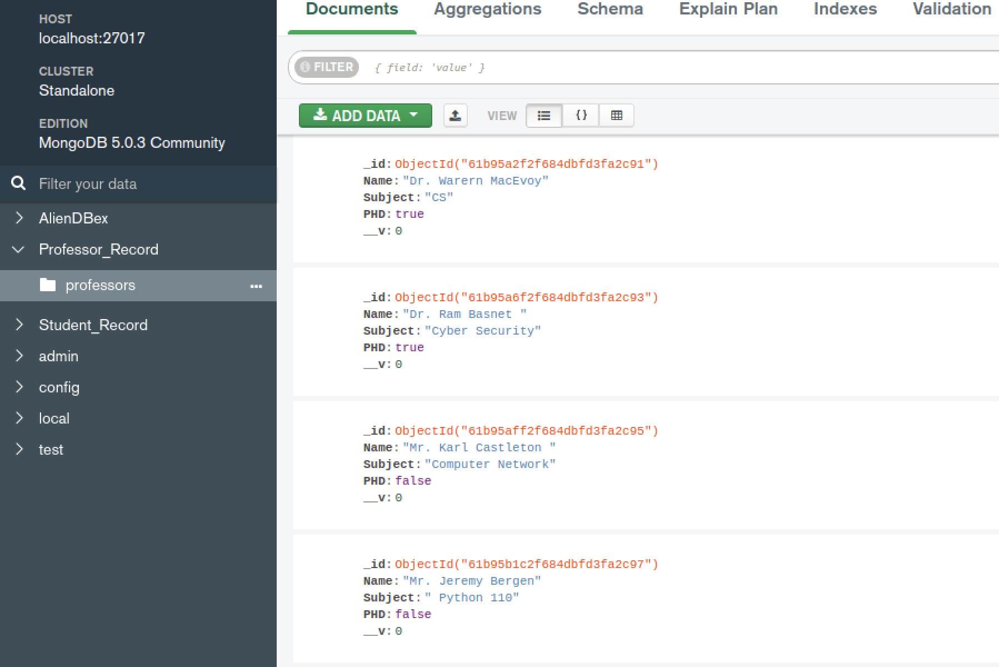
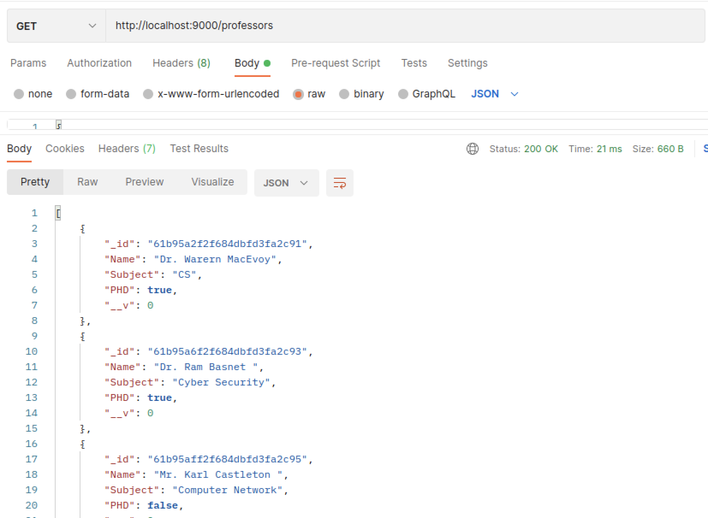
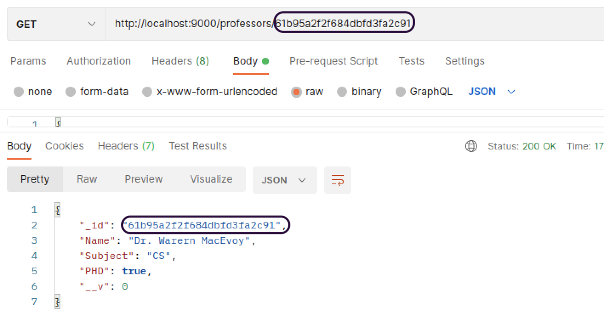
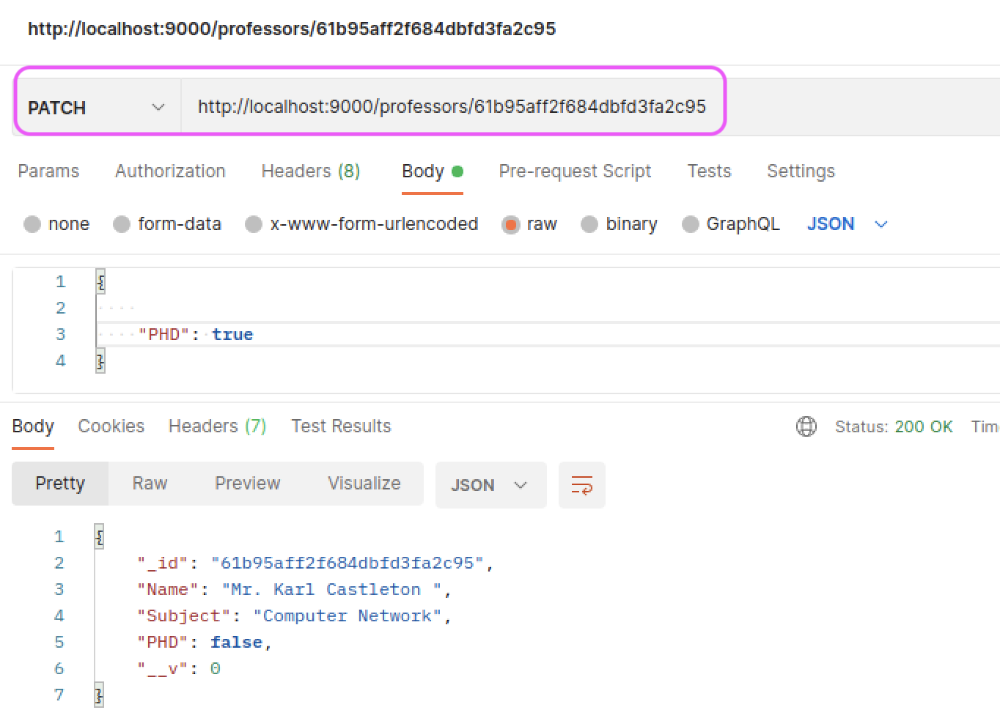
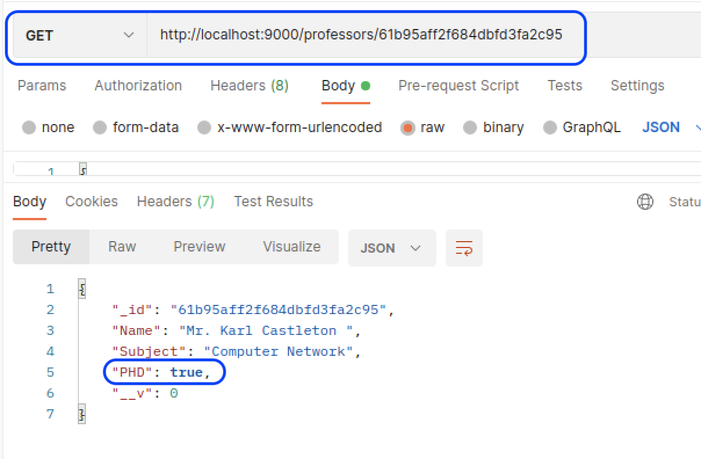
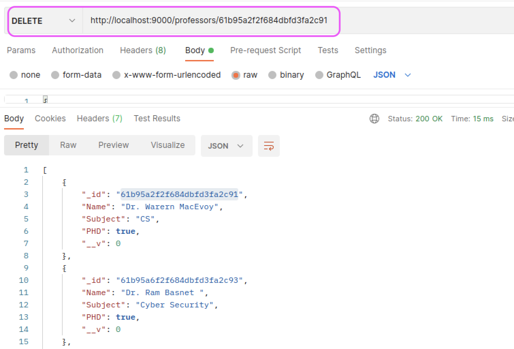

# Overview :
#  All Assignments completed for Web3

| # | Assignment | Due-Date | Completed |
|:---------:|-----------:|:---------:|:------------:|
| 1)| [Basic API with Node](https://github.com/RupeshPanta/Web3_Node_Basic_Api)  | NA | :white_check_mark: |
| 2) | [Basic API with Flask](https://github.com/RupeshPanta/Web3_Basic_API) | NA | :white_check_mark: |
| 3) | [Final](https://github.com/RupeshPanta/Web3-Final)  | NA| :white_check_mark: |


# Node API example is on this repo :

This is a simple Rest API that has CRUD functionality. I created this using Node, Mongodb as database and express as Server and have used postman to test http methods.
 

# Simple REST API wih Node
- Node rest api (CRUD)
    - [x] Post ---> Create
    - [x] Get  ---> REAd
    - [x] Patch ----> Update
    - [x] Delete --> Delete
- Real time modification with api


# To run this app
``` bash

open terminal
git clone this repo at first
Go to folder : Web3_Node_Basic_Api
type npm install 
type nodemon start run
server should run on localhost on port 9090
open postman and send api request

```
# About Different files:
```
- Check app.js for index page
- Check professors.js under routes for handeling different routes
- Check professors.js under models to see how I have defined schema for my data.
``` 
# Tools Needed :
-Download Mongodb Compass to analyze data visually and interact with database <br>
-Download Postman for testing Get, Post, Patch and Delete Functionality

# ScreenShots: 
-Server Running successfully <br> <br>
<br/> 
- # Post method  - > Adding data to Database
<br/>  <br>
Successfully added in Mongodb
<br/> <br/> 
<br/> <br/> 
# Get Method -> Reading data from database
<br/> <br/> 
-Get Method with id -> Reading data by ID <br>
<br/> <br/> 
# Patch method - >updating data 
<br>
-updating Castleton degree to PHD

<br/> <br/> 
<br/> <br/>
-After patching, get method will display patched data

<br>
# Delete method -removing data from database


<br/> 
-Verifying database for delete function
<br/> 

# References
https://github.com/wmacevoy/web3-wmacevoy

https://www.tutorialspoint.com/nodejs/nodejs_restful_api.html

https://www.youtube.com/watch?v=pKd0Rpw7O48&ab_channel=ProgrammingwithMosh

